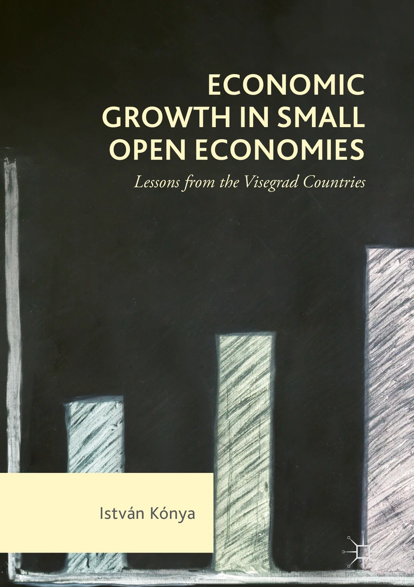

## Book

::: clearfix
{.float-end .ms-4 .mb-3 .img-fluid width="180px"}

### [Economic Growth in Small Open Economies](https://link.springer.com/book/10.1007/978-3-319-69317-0)

#### Lessons from the Visegrad Countries

**István Kónya** · *Palgrave Macmillan Cham* · 2018

This book studies the economic growth and development of four Visegrad economies (Czech Republic, Hungary, Poland and Slovakia) between 1995-2014. The first part of the book is structured around the concept of production function, factor inputs and growth accounting, and the second part of the book looks at selected problems related to economic developments of the analysed countries.
:::

## Book chapters

### [Economic Growth & Resilience](https://link.springer.com/chapter/10.1007/978-3-031-61561-0_2)
in: *Central and Eastern European Economies and the War in Ukraine*

**István Kónya** · **Péter Benczúr** · 2024

This chapter looks at the overall macroeconomic and social situation of the CEEE at the onset of Russia’s aggression on Ukraine and over the consecutive 18 months.

### [Convergence to the Centre](https://link.springer.com/chapter/10.1007/978-3-030-93963-2_1)
in: *Emerging European Economies after the Pandemic*

**István Kónya** · **Péter Benczúr** · 2022

This chapter focuses on the main macroeconomic developments in the Emerging European Economies (EEE) group leading up to and during the Covid-19 pandemic, and also on the longer-term outlook after the crisis.

## Journal articles

### [Which sectors go on when there is a sudden stop? An empirical analysis](https://www.sciencedirect.com/science/article/pii/S0261560624000974)

**István Kónya** · **Miklós Váry** · *Journal of International Money and Finance*, 146(C) · 2024

This paper analyzes the dynamics of sectoral Real Gross Value Added (RGVA) around sudden stops in foreign capital inflows.

### [Catching up or getting stuck: convergence in Eastern European economies](https://link.springer.com/article/10.1007/s40822-023-00230-2)

**István Kónya** · *Eurasian Economic Review*, 13(2), 237-258 · 2023

The paper studies the convergence and growth behavior of 11 Central and Eastern European members states of the European Union between 2000–2019, using a modified development accounting approach based on the neoclassical growth model.

### [Convergence stories of post‐socialist Central‐Eastern European countries](https://onlinelibrary.wiley.com/doi/10.1111/manc.12360)

**István Kónya** · **Dániel Baksa** · *Manchester School*, 89(3), 239-258 · 2021

This paper views the growth and convergence process of five Central‐Eastern European economies between 1996 and 2019—the Czech Republic, Hungary, Poland, Slovenia and Slovakia—through the lens of an open economy, stochastic neoclassical growth model with simple financial frictions.

### [Interest premium and external position: A state dependent approach](https://www.sciencedirect.com/science/article/abs/pii/S1042443120300767)

**István Kónya** · **Franklin Maduko** · *Journal of International Financial Markets, Institutions and Money*, 66(C), 239-258 · 2020

Using a broad sample of countries between 1980 and 2017, this paper re-examines the empirical relationship between sovereign yield spreads and the level of external indebtedness of advanced, emerging and less-developed economies in both normal and crisis periods.

### [Labor shares in the old and new EU member states – Sectoral effects and the role of relative prices](https://doi.org/10.1016/j.econmod.2020.05.010)

**István Kónya** · **Judit Krekó** · **Gábor Oblath** · *Economic Modelling*, 90(C), 254-272 · 2020

The paper documents lower labor shares in Central and Eastern European EU members and shows that relative prices explain an important part of the differences between older and newer member states.

### [An Open Economy DSGE Model with Search-and-Matching Frictions: The Case of Hungary](https://www.tandfonline.com/doi/full/10.1080/1540496X.2014.1000174)

**István Kónya** · **Zoltán Jakab** · *Emerging Markets Finance and Trade*, 52(7), 1606-1626 · 2016

This article builds and estimates a medium scale, small open economy DSGE model augmented with search-and-matching frictions in the labor market, and different wage setting behavior in new and existing jobs.

### [Interest Premium, Sudden Stop, and Adjustment in a Small Open Economy](https://www.tandfonline.com/doi/full/10.1080/00128775.2016.1196109)

**István Kónya** · **Péter Benczúr** · *Eastern European Economics*, 54(4), 271-295 · 2016

This article studies the adjustment process of a small open economy to a sudden worsening of external conditions.

### [Development accounting with wedges: the experience of six European countries](https://www.degruyterbrill.com/document/doi/10.1515/bejm-2012-0153)

**István Kónya** · *The B.E. Journal of Macroeconomics*, 13(1), 245-286 · 2013

The paper interprets the growth experience of three Western European countries (France, Germany and the UK) and three Central-Eastern European economies (the Czech Republic, Hungary, and Poland) through the lens of the neoclassical growth model.

### [Convergence, capital accumulation and the nominal exchange rate](https://www.sciencedirect.com/science/article/abs/pii/S026156061300082X)

**István Kónya** · **Péter Benczúr** · Journal of International Money and Finance*, 37(C), 260-281 · 2013

This paper develops a flexible price, two-sector growth model with a nominal side to study the role of the exchange rate in transition dynamics.

### [Optimal Immigration and Cultural Assimilation](https://www.journals.uchicago.edu/doi/10.1086/511378)

**István Kónya** · *Journal of Labor Economics*, 25(2), 367-391 · 2007

This article develops a model that examines the role of cultural conflict in immigration and immigration policy.

### [International Consumption Patterns among High‐income Countries: Evidence from the OECD Data](https://onlinelibrary.wiley.com/doi/10.1111/j.1467-9396.2007.00676.x)

**István Kónya** · **Hiroshi Ohashi** · *Review of International Economics*, 15(4), 744-757 · 2007

This paper examines the effect of economic integration on the product‐level consumption patterns across the OECD in the past decade.

### [Modeling Cultural Barriers in International Trade](https://onlinelibrary.wiley.com/doi/10.1111/j.1467-9396.2006.00626.x)

**István Kónya** · *Review of International Economics*, 14(3), 494-507 · 2006

The paper presents a model that analyzes the role of cultural differences in international trade.

### [Minorities and majorities: a dynamic model of assimilation](https://onlinelibrary.wiley.com/doi/10.1111/j.0008-4085.2005.00331.x)

**István Kónya** · *Canadian Journal of Economics*, 38(4), 1431-1452 · 2005

The paper analyses the population dynamics of a country that has two ethnic groups, a minority and a majority, and minority members can choose to assimilate into the majority.

Paste the following after the final entry in your existing **Journal articles** section:

## Other publications

### [The Connection between Institutions and Economic Development – the Work of the 2024 Nobel Laureates in Economics](https://doi.org/10.33893/FER.24.1.132)

**István Kónya** · *Financial and Economic Review*, 24(1), 132-155 · 2025

This essay reviews the contributions of Daron Acemoglu, Simon Johnson and James Robinson to understanding the formation of institutions and their effects on long-run economic development.

### [Interview with Professor Christopher D. Carroll](https://www.mnb.hu/letoltes/carroll.pdf)

**Christopher D. Carroll** · **Áron Kiss** · **István Kónya** · *MNB Bulletin*, 9(1), 58-64 · 2014

An interview with Christopher D. Carroll about household consumption and saving, heterogeneous-agent models, mortgages and macroeconomic policy.

### [Interview with Harald Uhlig](https://www.mnb.hu/letoltes/uhlig.pdf)

**Harald Uhlig** · **István Kónya** · **Katalin Szilágyi** · *MNB Bulletin*, 8(1), 62-67 · 2013

An interview with Harald Uhlig about macroeconomics, financial markets, Bayesian econometrics and the role of central banks during crises.

### [Interview with Fabio Canova](https://www.mnb.hu/letoltes/canova-eng.pdf)

**Fabio Canova** · **István Kónya** · **Katalin Szilágyi** · *MNB Bulletin*, 7(3), 73-78 · 2012

An interview with Fabio Canova about quantitative macroeconomics, time-series methods, international business cycles and forecasting.

### [Wage setting in Hungary: evidence from a firm survey](https://www.mnb.hu/letoltes/kezdi-konya-2009-okt-en.pdf)

**Gábor Kézdi** · **István Kónya** · *MNB Bulletin*, 4(3), 20-26 · 2009

Using the Eurosystem Wage Dynamics Network survey, the article shows that Hungarian firms operate in a flexible institutional environment but display relatively rigid wage-setting practices.

## Hungarian publications

### [A bérhányad alakulása Magyarországon és Európában](https://doi.org/10.18414/KSZ.2021.10.1021)

**István Kónya** · **Gábor Oblath** · **Judit Krekó** · *Közgazdasági Szemle*, 68(10), 1021-1054 · 2021

The paper examines labor-share developments in Hungary and Europe, with particular attention to sectoral composition, employers’ social contributions and the role of relative prices.

### [Külkereskedelem, regionális különbségek és a képzettek vándorlása](https://doi.org/10.18414/KSZ.2019.6.635)

**István Kónya** · *Közgazdasági Szemle*, 66(6), 635-652 · 2019

The paper analyses the relationships among foreign trade, regional development differences and the geographical mobility of skilled workers.

### [A magyar növekedésről – egy régimódi megközelítés](https://doi.org/10.18414/KSZ.2017.9.915)

**István Kónya** · *Közgazdasági Szemle*, 64(9), 915-929 · 2017

Starting from the fundamental questions of growth theory, the paper reviews the Hungarian economy’s growth experience over the preceding two decades.

### [Növekedés és pénzügyi környezet](https://doi.org/10.18414/KSZ.2017.4.349)

**István Kónya** · **Dániel Baksa** · *Közgazdasági Szemle*, 64(4), 349-376 · 2017

Using an estimated stochastic neoclassical model, the paper studies the roles of technology, growth and interest-premium shocks in Hungary’s economic growth between 1995 and 2015.

### [Munkapiaci áramlások Magyarországon és Európában](https://doi.org/10.18414/KSZ.2016.4.357)

**István Kónya** · *Közgazdasági Szemle*, 63(4), 357-379 · 2016

The paper proposes a method for identifying macroeconomically relevant labor-market transition probabilities from aggregate stock data.

### [Több gép vagy nagyobb hatékonyság? Növekedés, tőkeállomány és termelékenység Magyarországon 1995–2013 között](https://doi.org/10.18414/KSZ.2015.11.1117)

**István Kónya** · *Közgazdasági Szemle*, 62(11), 1117-1139 · 2015

The paper recalculates total factor productivity in Hungary and decomposes GDP growth into contributions from capital, productivity and human capital.

### [Kamatfelár, hitelválság és mérlegalkalmazkodás egy kis, nyitott gazdaságban](https://www.kszemle.hu/tartalom/letoltes.php?id=1410)

**Péter Benczúr** · **István Kónya** · *Közgazdasági Szemle*, 60(9), 940-964 · 2013

The paper analyses how a small open economy adjusts following a sudden deterioration in external financing conditions.

### [Munkapiaci súrlódások DSGE-modellekben](https://www.kszemle.hu/tartalom/letoltes.php?id=1332)

**István Kónya** · **Zoltán M. Jakab** · *Közgazdasági Szemle*, 59(9), 933-962 · 2012

The paper reviews how search-and-matching frictions can be incorporated into dynamic stochastic general equilibrium models.

### [Növekedés és felzárkózás Magyarországon, 1995–2009](https://www.kszemle.hu/tartalom/letoltes.php?id=1239)

**István Kónya** · *Közgazdasági Szemle*, 58(5), 393-411 · 2011

The paper uses growth accounting to analyse Hungary’s growth and convergence performance between 1995 and 2009.

### [Nominális növekedés egy kis, nyitott gazdaságban](https://www.kszemle.hu/tartalom/letoltes.php?id=769)

**István Kónya** · **Péter Benczúr** · *Közgazdasági Szemle*, 52(6), 556-575 · 2005

The paper uses a small-open-economy growth model with nominal variables to examine the relationship between the exchange rate and real economic convergence.

### [Családok és iskolák – az oktatáspolitika lehetőségei](https://www.kszemle.hu/tartalom/letoltes.php?id=130)

**István Kónya** · *Közgazdasági Szemle*, 43(12), 1088-1103 · 1996

The paper places human-capital investment in a family decision framework and uses it to examine the potential effects of government education programmes.
